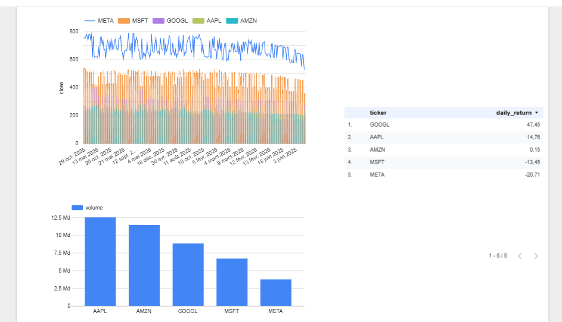

# Stock Market Data Pipeline

Pipeline de données end-to-end pour l'analyse des marchés financiers.

## Architecture
Yahoo Finance API -> Google Cloud Storage -> BigQuery -> Looker Studio

## Stack technique
- Python (yfinance, pandas)
- Google Cloud Storage (Data Lake)
- BigQuery (Data Warehouse)
- Looker Studio (Dashboard)

## Dashboard


## Résultats
- 5 actions trackées : AAPL, GOOGL, MSFT, AMZN, META
- 1260 lignes de données historiques sur 1 an
- Calcul automatique du daily return

## Lancer le pipeline
```bash
pip install -r requirements.txt
python ingestion/ingest.py
python transformation/transform.py
```